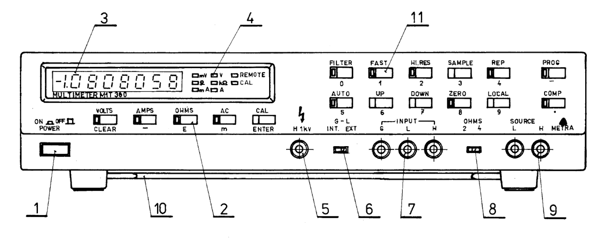

# Metra M1T380 documentation

# Index

- [MHB8748](/mhb8748) - reverse-engineered MHB8748 firmware with documentation
- [Multimeter documentation](/doc) - schematics, manuals, some datasheets
- [Firmware](/fw) - firmware files for 8080 CPU and 8748 MCU

# License

Unless explicitly specified otherwise in respective files, all my personal
contributions in this repository are provided under the terms of
[LICENSE](/LICENSE) which applies to the extent permitted by the applicable law
(this being an abandonware reverse-engineering project, you are never sure what
the law is).
